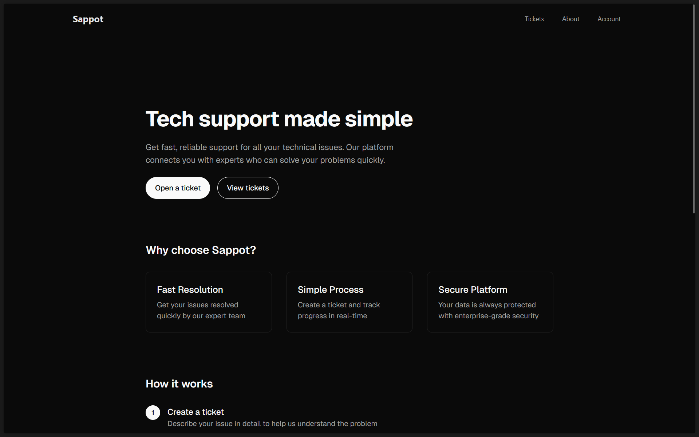
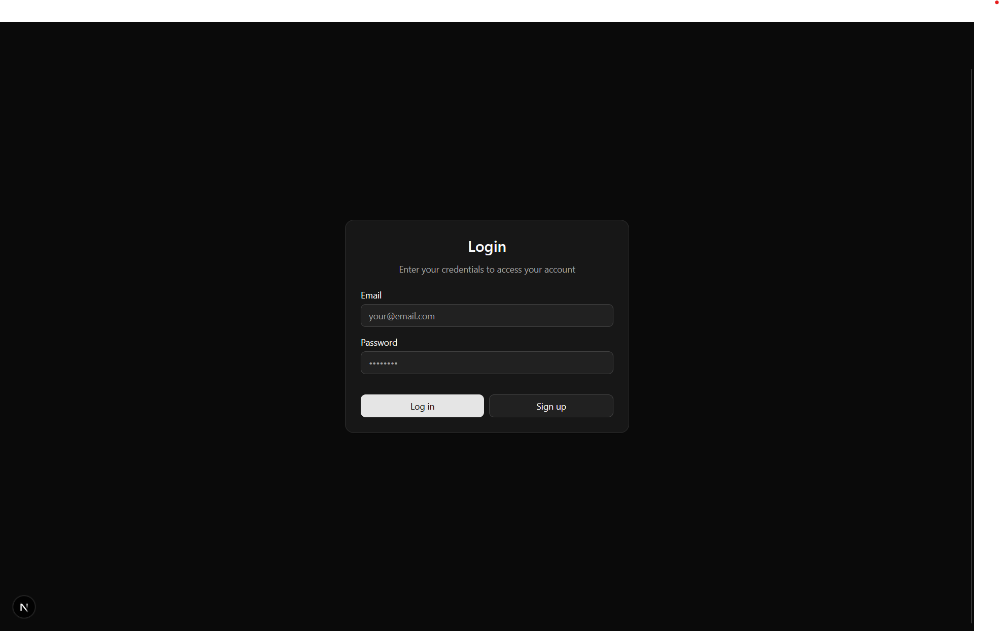
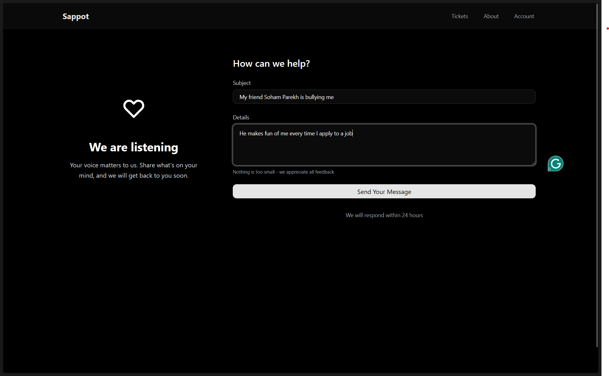
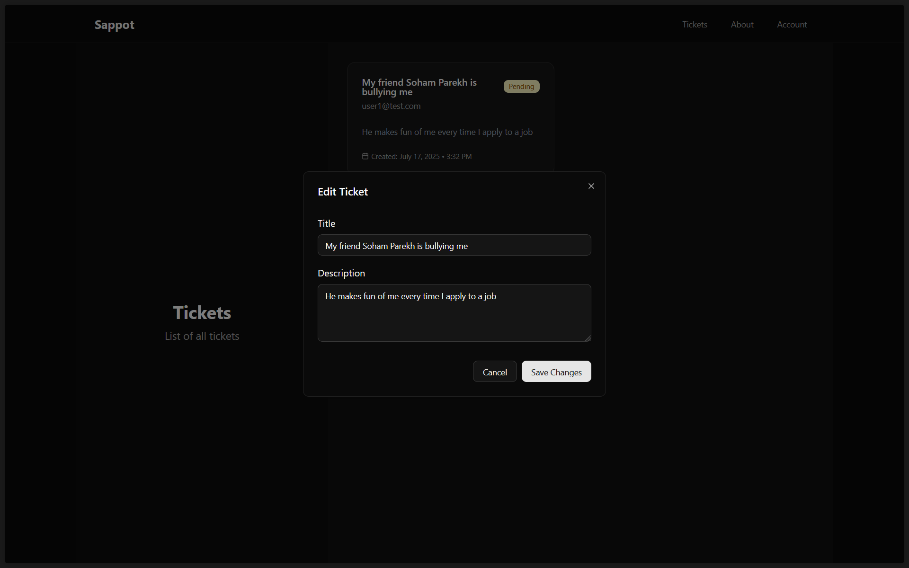
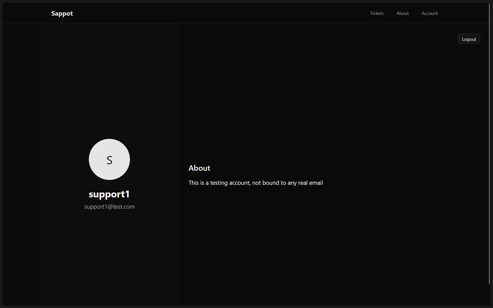
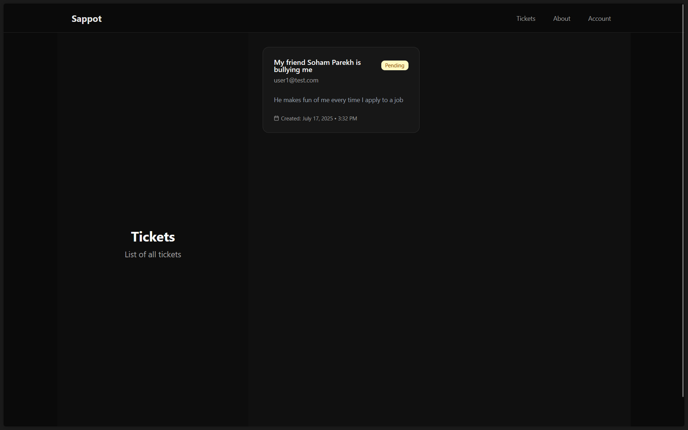
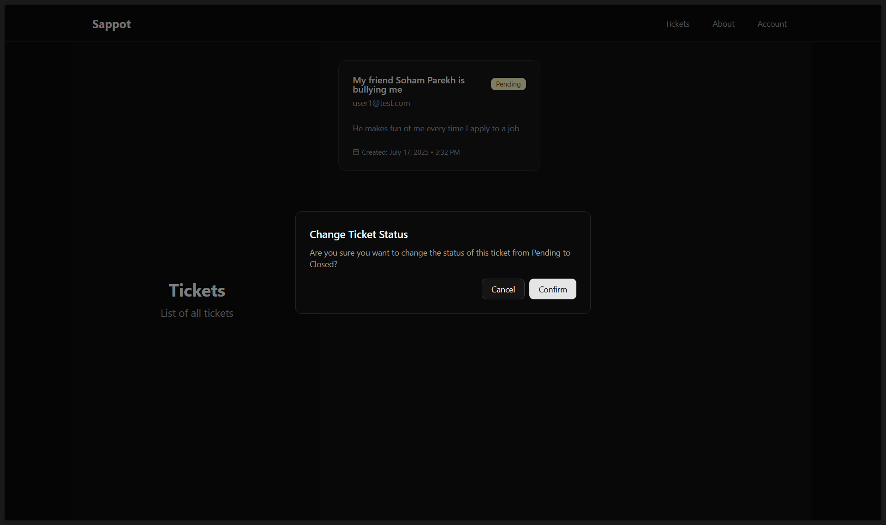
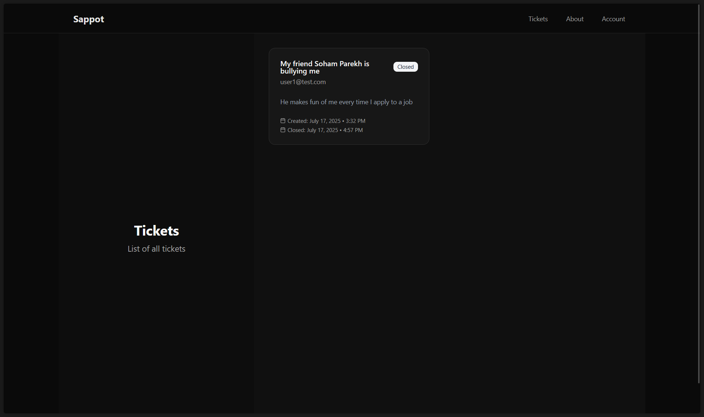
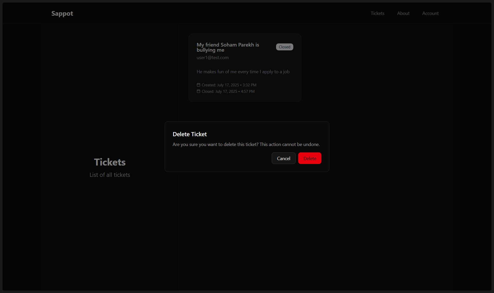
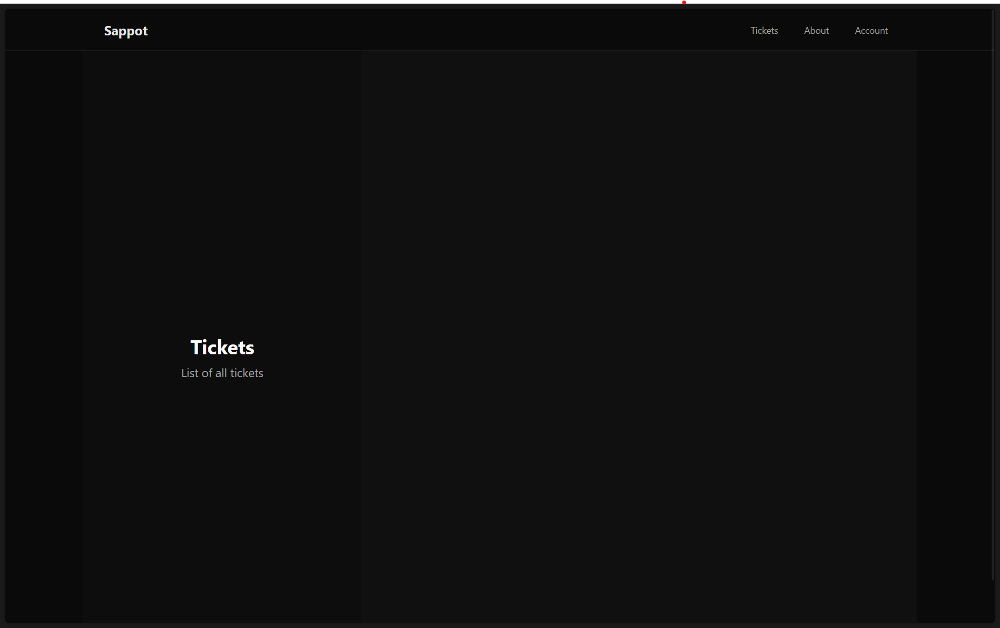

# Overview

Hosting is expensive, and I'm not a millionaire (yet). So I've compiled a preview of how this project looks and works when in production incase you're looking at this after my free instance has spinned down ;)

# What is this?

This project is a POC to demonstrate how role-based access control allows modern applications to secure their systems and data better by moving away from the naive approach of defining permissions for individual users and instead creating a bunch of permissions that are assigned to user-groups (or roles). This gives fine grained access control when interacting with servers and databases.

This specific implementation assumes an IT help desk. There are 3 users, 2 support staff, and 1 admin. Users can create tickets but trying to "fetch-all" from the database only returns the tickets that were created by the requesting user, this filtering happens at the database layer. Each user can also edit their ticket once created.

The support staff can only change the status of a ticket from "open" to "closed" or vice-versa.

Meanwhile the admin has the most privileged access as they can also delete tickets from the database entirely (Good for hiding shady bizness)

# Preview

### The Home page you arrive on:

### Turns out you need to login to complain:

### Okay now that you've logged in, you can finally tell on your friend who has been bullying you

### Incase you need to edit your ticket once you already opened it (jokes aside, make sure that you dont let this go out of hand in prod. Limit the edit timeframe)

### Okay the support staff clocks in for work now

### They check the list of tickets they have for the day

### Turns out it's just one guy getting bullied in this tough job market, so they just go ahead and close the ticket (Bad customer support)

### You log back into your account to see if customer support helped (they didn't, they just closed the ticket)

User (You) POV:

### You're furious, you try to escalate this issue to the manager (unfortunately they're equally unhelpful). They deleted your ticket

Manager POV:

### You try to get the ticket's reference ID to sue them but you see an empty dashboard (Shocker)

User (You) POV:

It turns out that Soham Parekh also took up a job as the manager at a customer service agency
